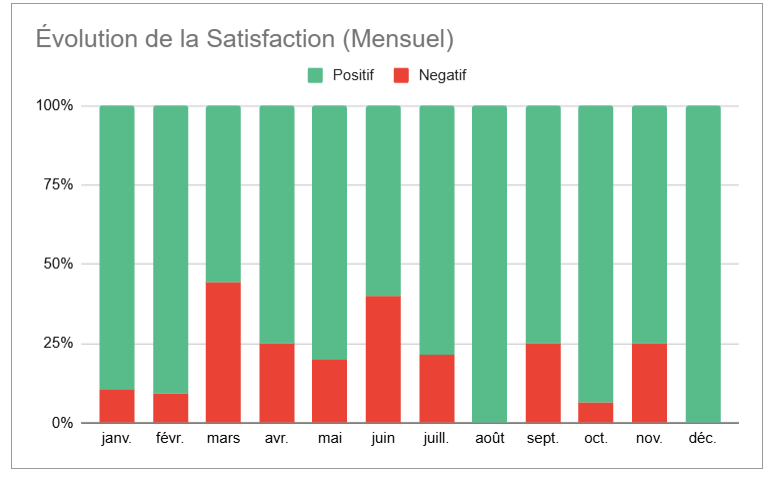
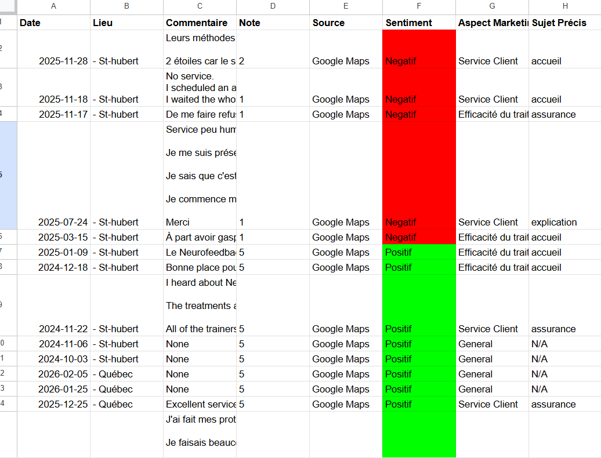
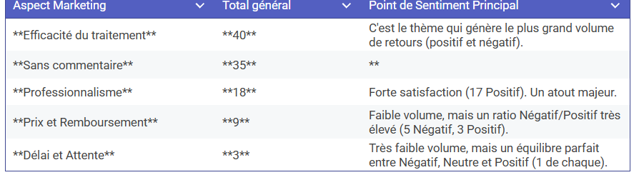
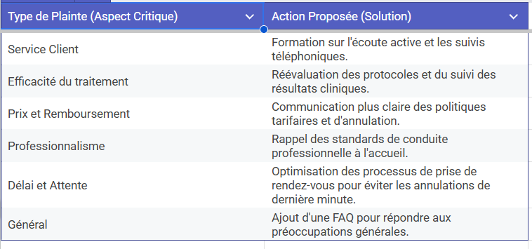

# Analyse de Sentiments & Insights Stratégiques - Neuroperforma

Ce projet automatise la collecte et l'analyse de la réputation en ligne pour les cliniques Neuroperforma. Grâce à l'Intelligence Artificielle (NLP), les avis clients sont transformés en indicateurs de performance et en plans d'action concrets.

## Fonctionnalités Clés
* **Collecte Multi-plateforme** : Extraction automatisée des avis Google Maps et Facebook via Apify.
* **Analyse IA Hybride** : Utilisation du modèle **BART-Large-MNLI** pour une classification thématique précise (Zero-Shot Learning).
* **Reporting Décisionnel** : Dashboard dynamique dans Google Sheets avec suivi mensuel de la satisfaction.

---

## Aperçu du Projet

### 1. Évolution de la Satisfaction
Ce graphique permet de suivre le ratio d'avis positifs et négatifs au fil des mois, offrant une vision claire de la tendance de satisfaction globale.

### 2. Classification par Intelligence Artificielle
Ici, on voit le moteur de l'analyse : chaque commentaire est automatiquement classé par sentiment et par sujet marketing (Prix, Efficacité, Accueil, etc.).

### 3. Synthèse et Insights Marketing
Ce tableau résume les thèmes générant le plus de volume et identifie les atouts majeurs de l'entreprise ainsi que les points de friction.

### 4. Recommandations et Solutions Business
La finalité du projet : proposer des actions concrètes (formations, réévaluation de protocoles) basées sur les données extraites.

---

## Technologies
* **Python** (Pandas, Transformers, HuggingFace).
* **APIs** : Apify SDK, Google Sheets API.
* **Data Viz** : Google Sheets Dashboard.

---
*Projet développé pour optimiser la qualité du service client chez Neuroperforma.*
